<h1 align="center">NUMBER GUESSING GAME</h1>

Number Guessing Game is a Python terminal game which runs in the Code Institute mock terminal on Heroku.

Players can try to guess a number that the computer randomly generates.  There are 3 difficulty levels the player can choose to play - easy, medium or hard.  

The live site can be found [here](https://guessing-game-pp3.herokuapp.com/)

<h2 align ="center"></h2>

# How to play

The game is between the computer and 1 player.  The player must enter a name and then select the difficulty level (easy, medium or hard).  The computer will then think of a random number within a known range and the user has to guess the correct number within a limited amount of tries.  If the player enters invalid data, they will have the option to quit or try again.  Win or lose, the player will be asked if they would like to play again.

# Design

## Flowchart

<h2 align ="center">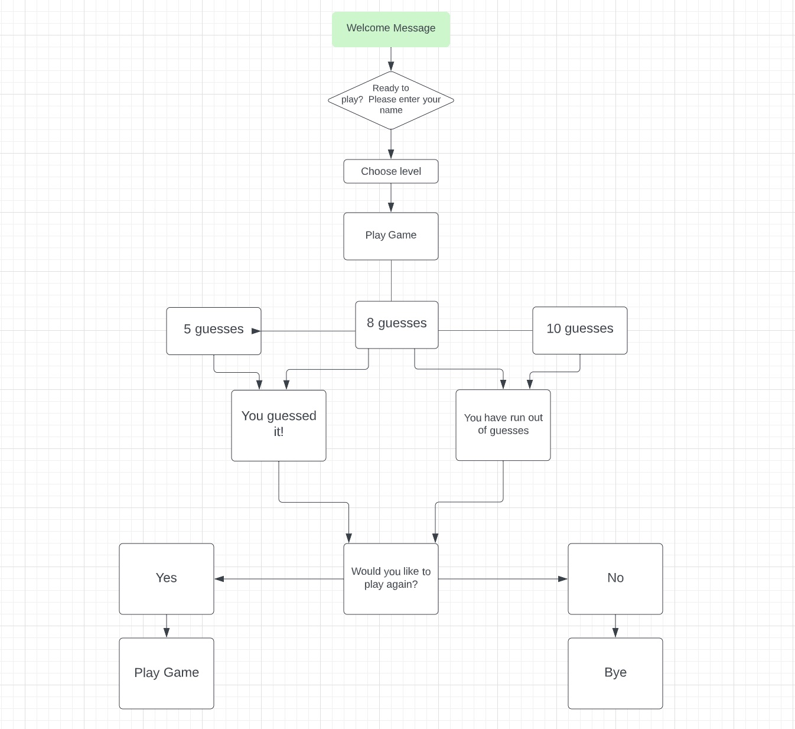</h2>

# User Experience

## User Goals
- As a user, I want to play a fun guessing game
- As a user, I want to choose how challenging I want the game to be 
- As a user, I want the game to be user-friendly

## User Stories 
- As a user, I want to play a game that is straightforward and immediately easy to understand
- As a user, I want to be able to select the difficulty level of the game
- As a user, I want to be alerted to invalid input and given the chance to re-enter data 
- As a user, I want feedback and hints on my progression
- As a user, I want feedback on whether I have won or lost
- As a user, I want the option to quit or play again 

# Features

## Welcome Message
- The player is greeted with a welcome message, name of the game and a short message explaining the aim of the game.

<h2 align ="center">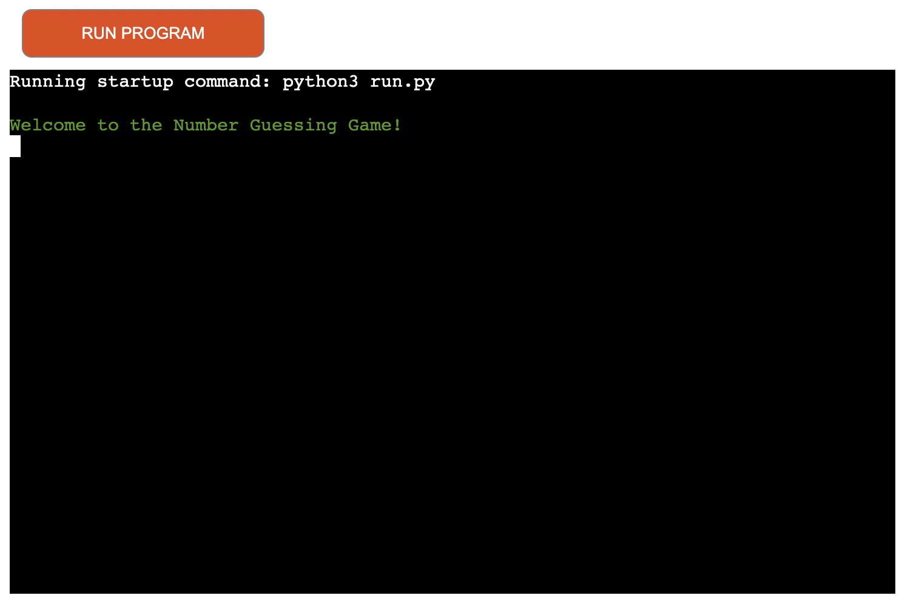</h2>

## Ready to Play
- The player is taken to the next page which asks if they are ready to play and they are then prompted to enter a name.

<h2 align ="center">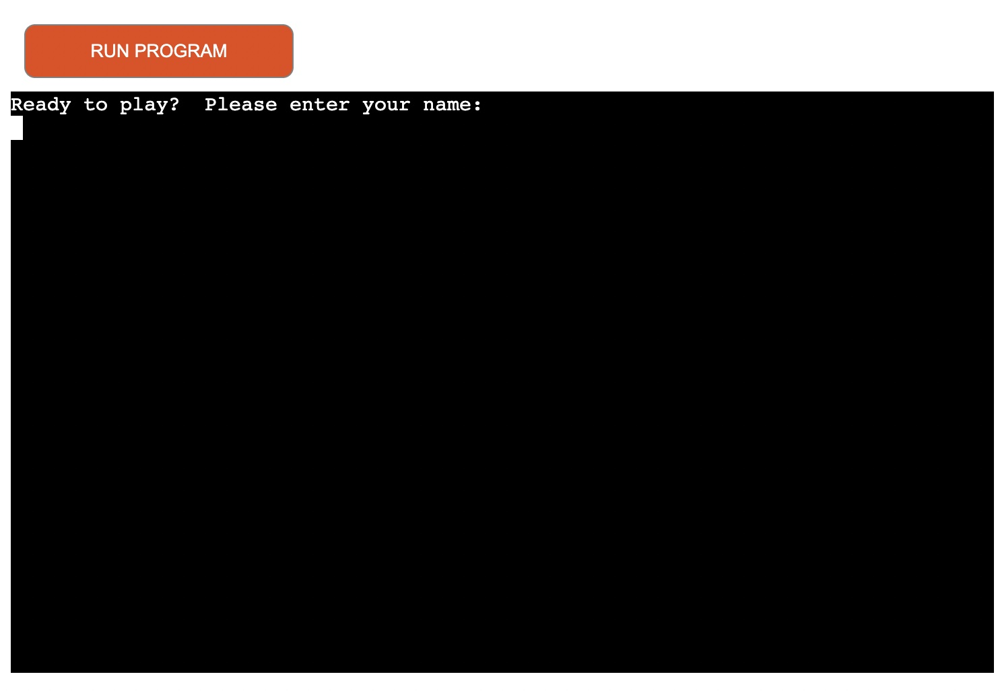</h2>

- If the player enters a blank space or non letter character, an error message will alert them that a name is required to play.

<h2 align ="center">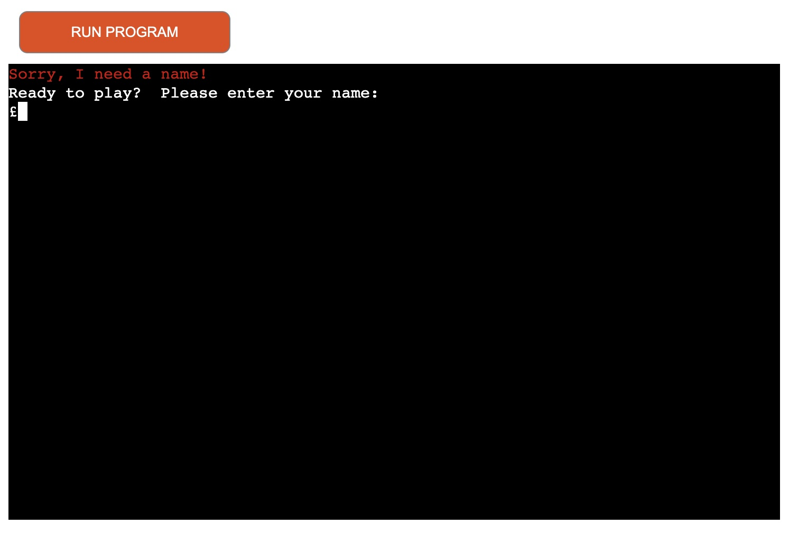</h2>

## Select Difficulty Level
- The player is greeted and then asked to select level - easy, medium or hard.

<h2 align ="center">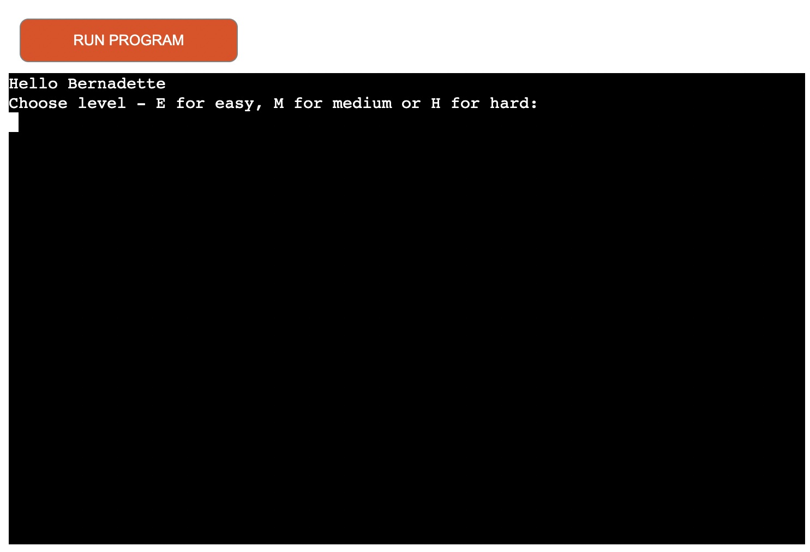</h2>

- If user enters anything other than e, easy, m, medium, h, hard, an error message will alert them to correctly select the level.

<h2 align ="center">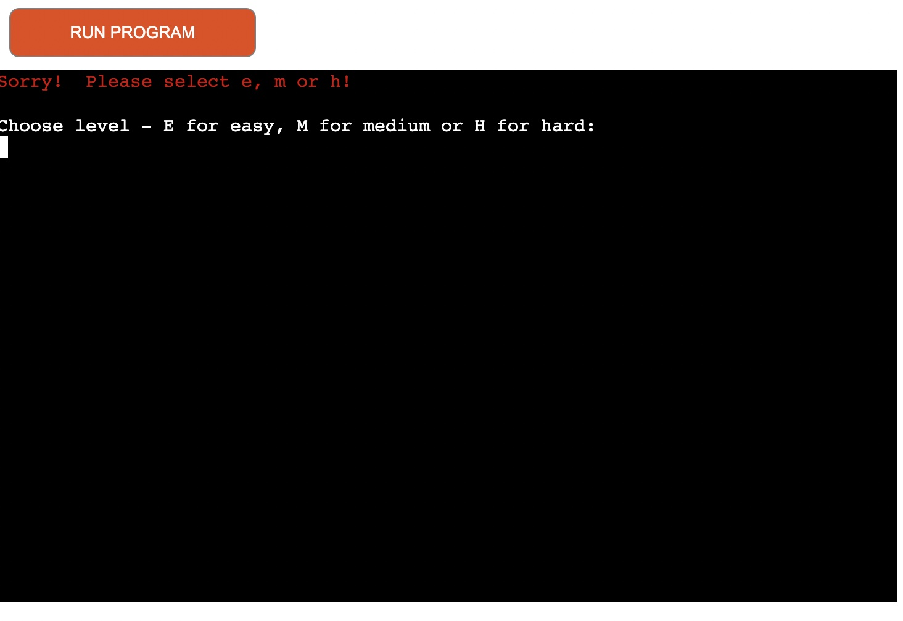</h2>

## Game Play
- The computer tells the player it is thinking of a number between 1 and 10, 1 and 100 or 1 and 500 depending on the difficulty level selected by the player.  

<h2 align ="center">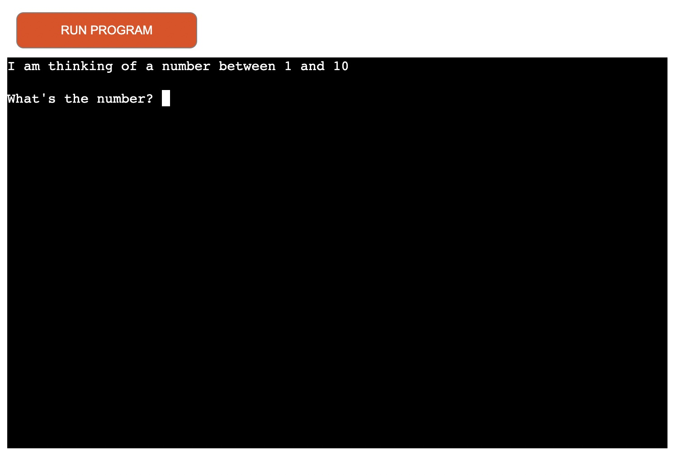</h2>

- The player will receive hints if their guess needs to be higher or lower

<h2 align ="center">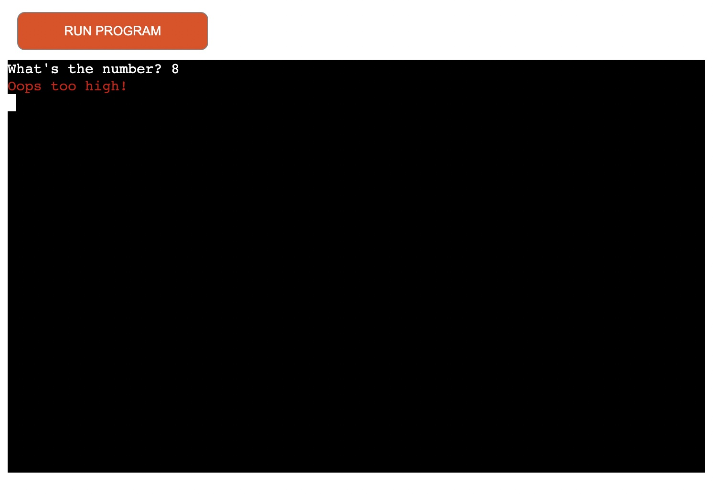</h2>

- The player will be alerted if they have entered an invalid guess (such as a letter, blank space or character) and they will be prompted to try again.  The player will also have the option to quit.

<h2 align ="center">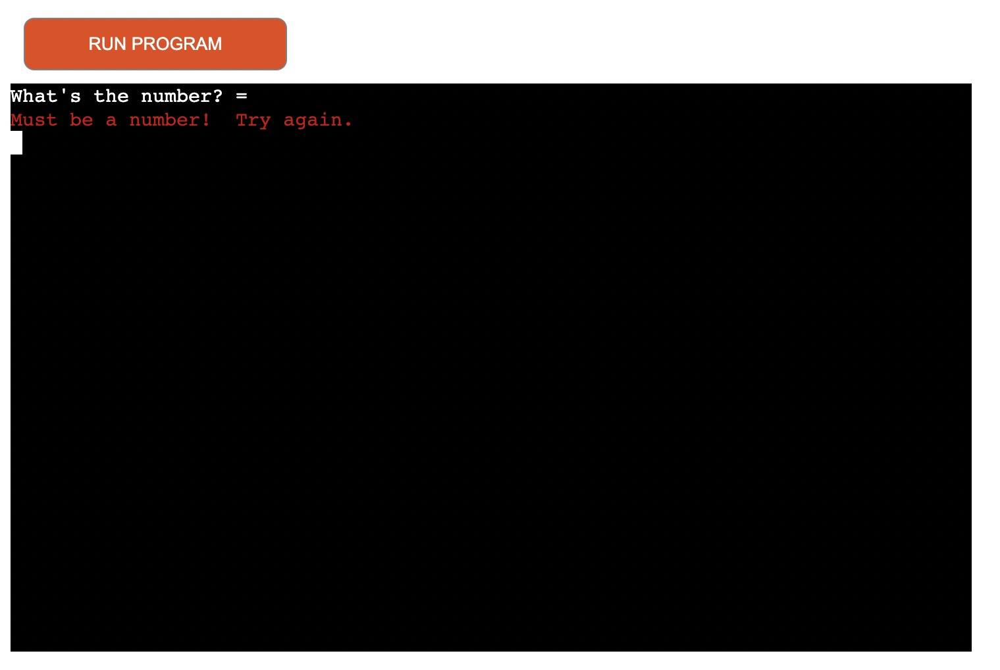</h2>
<h2 align ="center">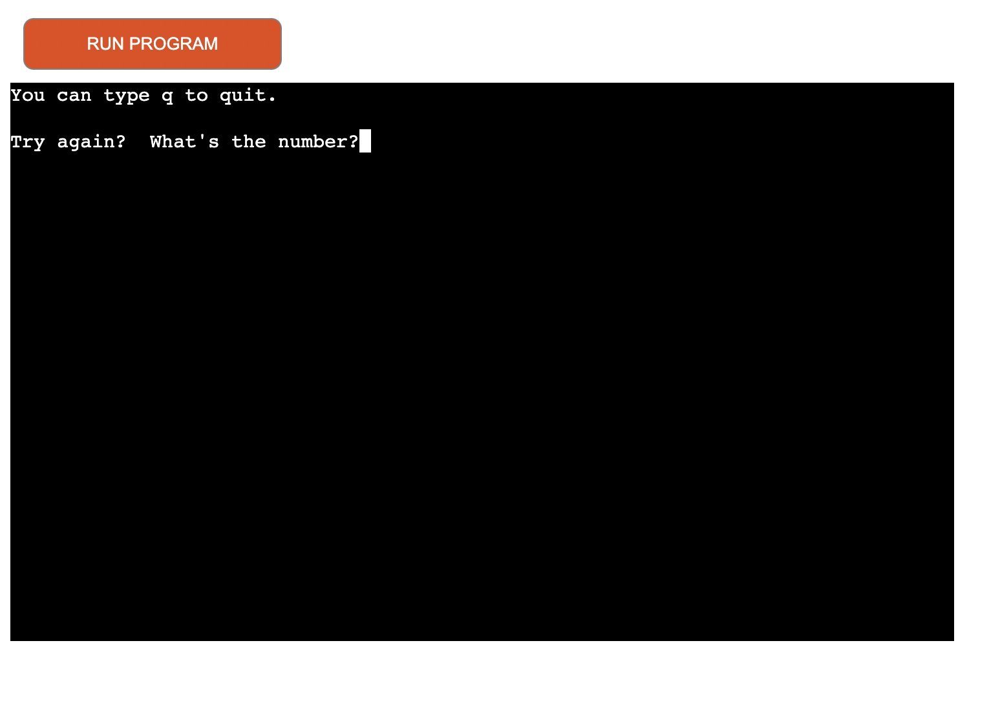</h2>

- If the player runs out of guesses, they lose the game and the correct number is advised.  The computer will also ask if they would like to play again.  

<h2 align ="center">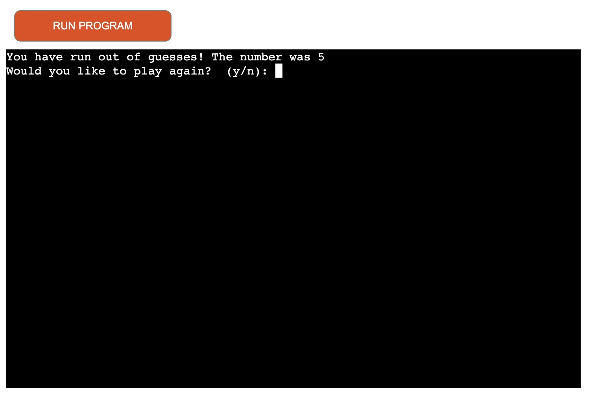</h2>

- If the player wins the game, a message will appear telling them they got it and however many tries they had.  The computer will also ask if they would like to play again.  

<h2 align ="center">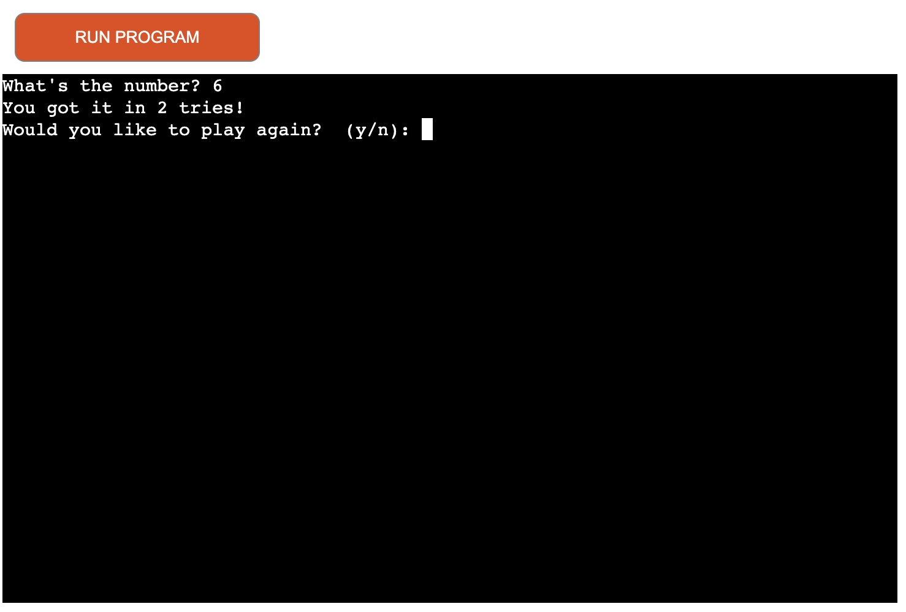</h2>

- If the player selects n for no, the computer will thank the player for playing and say bye.  If they select y for yes, the game will start again from the choose level page.

<h2 align ="center">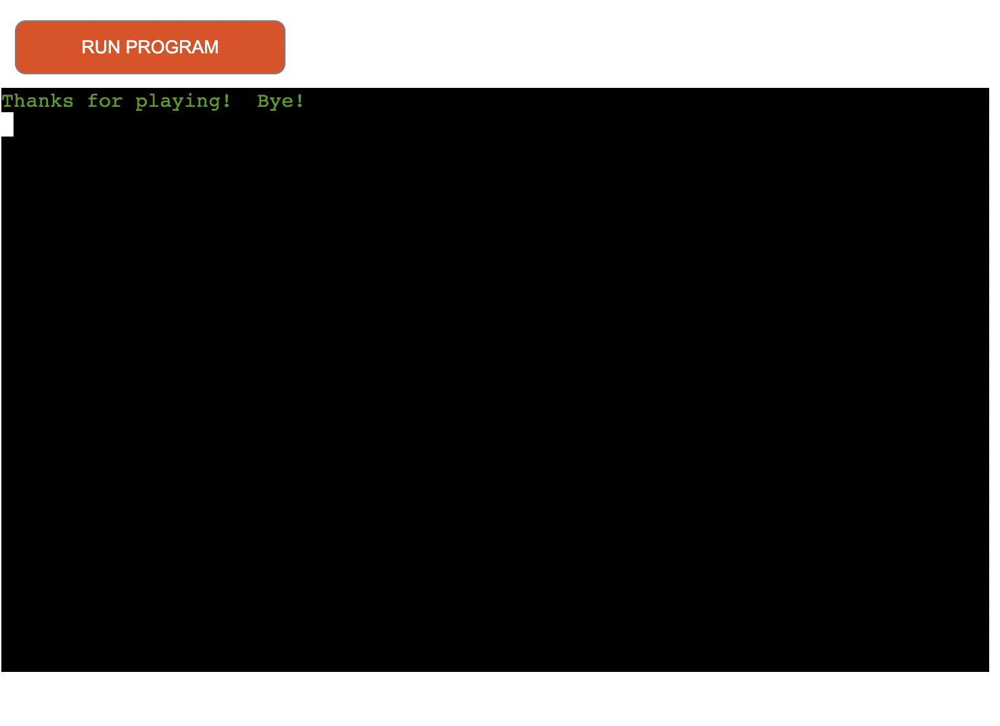</h2>

## Future Features
- I would like to add a main menu to the welcome page
- I would like to add a leaderboard
- I would like to add a count of how many guesses the player has used during the game

# Testing

##  Testing User Stories 

1.   I want to play a game that is straightforward and immediately easy to understand and use
- From the moment the welcome message appears, the user knows what the aim of the game is.  

2.   I want to be able to select the difficulty level of the game
- The user is able to choose between 3 levels - easy, medium or hard.  This is quite user friendly as it will accept any input that is close enough to one of the 3 levels eg: either the first letter or the full word (e or easy etc).  

3.   I want to be alerted to invalid input and given the chance to re-enter data or quit
- Invalid input is handled with alert messages and prompts at every point a user can enter data:
 - When user is asked to enter their name, if any invalid data (number, character or blank space) is entered, an alert is printed telling user it must be a name.  
 - When user is asked to select difficulty level, if any invalid data is entered, an alert is printed telling user to select either e, m or h.
 - During game play, the user is also given the option to quit or try again if invalid data is entered.
 - If a user wants to quit, the game will thank them for playing but they will also be asked if they would like to play again and if they enter invalid data (not y or n) then they will be asked again until they enter either y or n. 

4.   I want feedback and hints on my progression
- The user receives a hint about their current guess and whether the following guess needs to be higher or lower.

5.  I want feedback on whether I have won or lost
- If the user loses the game, they are told that they have run out of guesses.  If they win the game, they are told how many tries they had.

6.   I want the option to play again 
- At the end of each game, the user will be asked if they would like to play again.

## More Testing

- I ran my code through Pep8 Online and initially received a few issues about whitespace and too many blank lines at the end of the code.  I have fixed these warnings/errors and now there are no issues.

<h2 align ="center">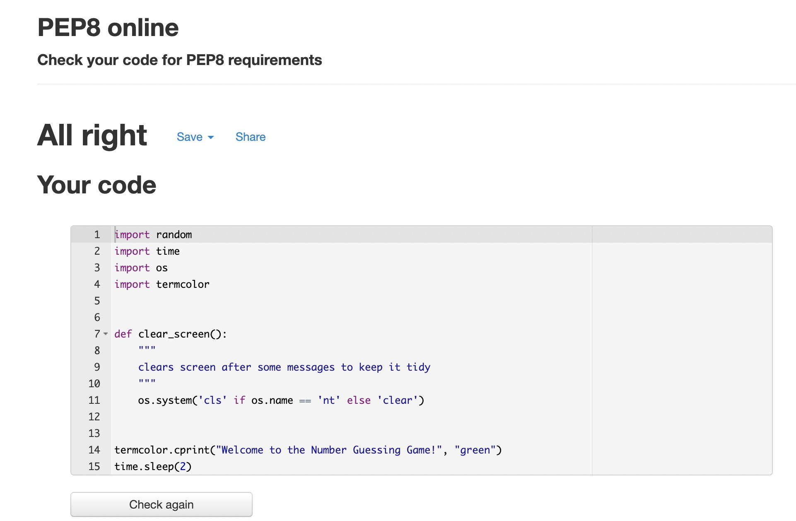</h2>

## Errors/Bugs/Issues
- The "You have run out of guesses" message would not print alone without a hint message.  I fixed this by changing the positioning of it - I moved it underneath the code that checks if input is an integer.

- After the above change, this then caused the "You got it in X tries" to start printing when it wasn't meant to.  I fixed this by adding the "You have run out of guesses" code into an else statement.

- The program had a bug where after selecting the difficulty level the user is asked what's the number and if the user gives invalid/empty data, the program asks the user to choose the difficulty level again instead of asking the user what the number is again.  This wasn't a good user experience so this was fixed by adding two functions - generate_number() and gets_guess_number().

- There was a bug that existed where print message "You have run out of guesses!  The number was 0" would sporadically appear at the end of some games alongside the correct message.  Josh in Tutor Support helped me figure out this was activated when invalid data was entered while selecting difficulty level.  To handle the invalid data I was running the play_game() function inside itself but as the game hadn't actually been played, it was triggering the "You have run out of guesses" print message.  I fixed this by setting a boolean to a variable - continue_play = False.

- An error (UnboundLocalError: local variable 'guess' referenced before assignment) was crashing the program but has now been fixed by declaring the guess variable.  

- While loop in main() function was altered to handle input that isn't y or n - without this, the game would just terminate.  Now, it will ask the user the question again until the correct data is added.

# Technologies

## Languages
- Python

## Libraries and Programs Used

### Github
- Storing code and deployment

### Gitpod
- Used for writing and editing code 

### Random Library
- Used to generate a random number for the game

### Time Library
- Used to slow the pace of messages appearing 

### Os Library
- Used to clear the terminal 

### Termcolor
- Used to add color to specific text throughout the game

### Lucidchart.com
- Used to design my flowchart for the game

### Am I Responsive
- Used to show how my game would display on different devices

### Heroku
- Used to deploy the game 

# Deployment

The game has been deployed using CI's mock terminal for Heroku
- Fork or clone repository 
- Create a new Heroku App
- Go to the settings tab and find the Config Vars section. Click 'Reveal Config Vars'.
- In the field for KEY enter PORT in all capitals, then in the field for VALUE enter 8000. Then click 'Add'.
- Set the buildpacks to Python and Node JS in that order
- Click 'deploy' tab and from the 'Deployment method' section select GitHub and click 'Connect to GitHub'.
- Enter the repository name as it is in GitHub and click 'search'.
- Click the 'connect' button next to the repository to link it to heroku.
- To deploy, scroll down and click the 'Deploy Branch' button.

# Credits

## Youtube Tutorials
- Processorbot - "Number Guessing Game"
- Code With Me - "Python Functions - Guess the Number Game"
- Wrt Tech - "Python - Random Number Guessing Game"

## Stackoverflow 
- How to check user input is a string
- How to clear the screen in Python

## Replit.com
- How to use termcolor 

## CI course material and README example
- Love Sanwiches
- PP3 README example provided 

## Josh in Tutor Support 

## My new mentor Seun was really helpful and offered great advice and suggestions

